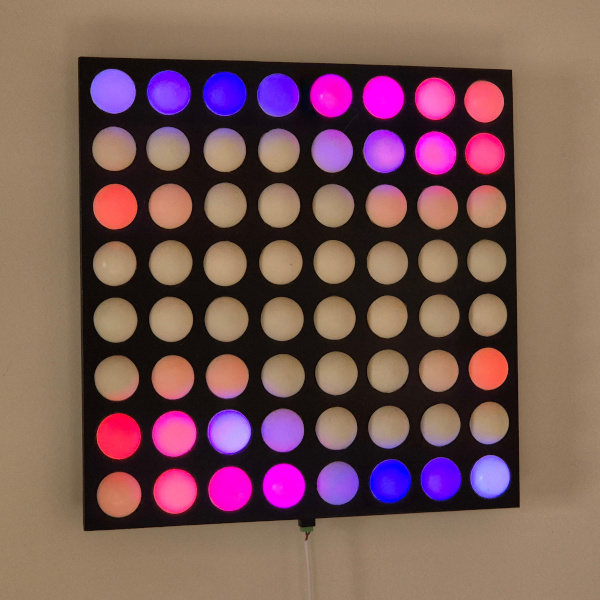
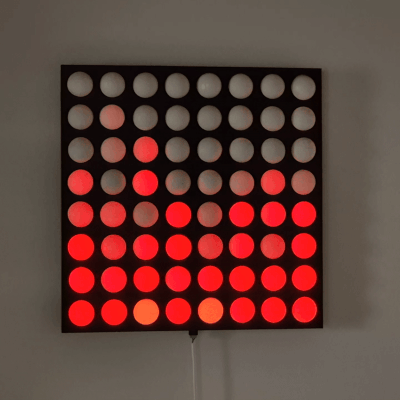
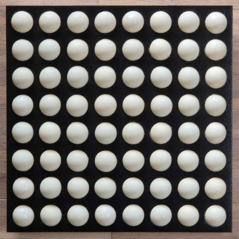
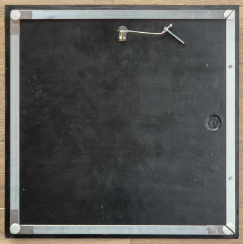
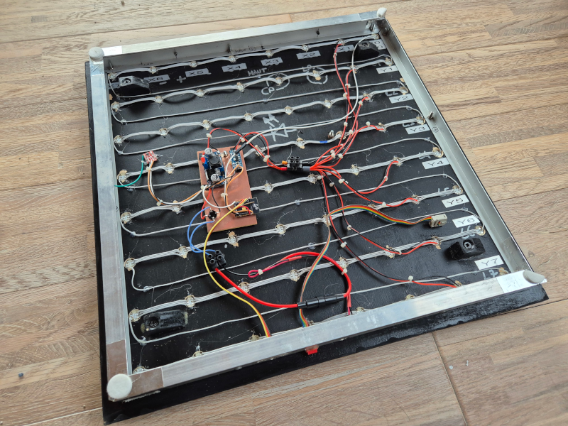
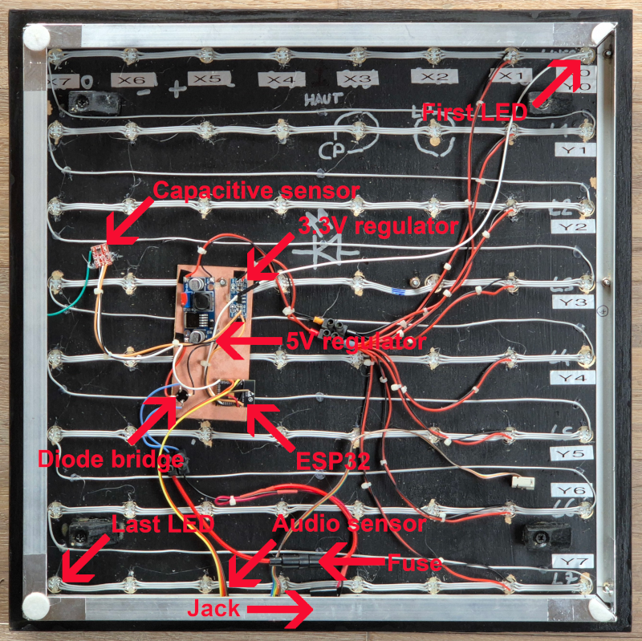
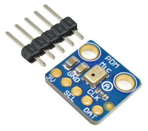
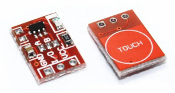

# ESPHome LED Pong

Read this in other languages: [English](README.md)

## Présentation

Il s'agit d'un dispositif constitué de 64 leds organisées en 8 lignes de 8.

Commencé il y a plus de 10 ans puis mis en pause, ce projet était initialement conçu pour être piloté par un microcontrôleur AVR et de simples LEDs rouges. Avec l’arrivée des LEDs RGB chainables de type WS2812B, la conception est devenue beaucoup plus simple. J’ai donc repris le développement en utilisant exclusivement des LEDs WS2812B, ce qui permet de contrôler facilement la luminosité et les couleurs. Par ailleurs, l’utilisation d’un ESP32, bien plus performant que l’AVR prévu à l’origine, a grandement simplifié le développement. Côté logiciel, j’ai entièrement basé le projet sur ESPHome pour en faciliter encore davantage la gestion et l’intégration.

Les effets par défaut d'ESPHome sont configuré par avance mais il est très simple d'en ajouter d'autre, ci-dessous, l'effet `Fire`:

Un exemple d'effet qui réagit en fonction des sons de la pièces:

## Caractéristiques

* Pilotage d'une matrice de 64 leds RGB
* Capteur sonore et capactifi pour changer les effets
* Utilisation de ESPHome pour faciliter l'intégration notamment avec un système domotique

## Fabrication

Liste du matériel:

* Support en bois + cadre en aluminium
* 32 balles de ping pong à couper en 2 délicatement
* 64 leds de type WS2812B
* Une carte ESP32
* Un régulateur 5V en mesure de fournir le courant nécessaire au leds
* Un micro PDM type MP34DT01
* Capteur capacitif

### Matrice de Led

The first WS2812B led is connected on the GPIO26 pin of the ESP32 puis les leds sont chainées (voir photo).

### Alimentation

J'alimente le montage via une alimentation secteur de 12V et une prise jack située en bas, un fusible est présent par sécurité, un pont de diode permet de ne pas avoir à se soucier de la polarité de l'alimentation.

Le 12V attaque un régulateur de 5V qui va être utilisé pour les leds.

Enfin, un régulateur de 3.3V sert à alimenter l'ESP32, vous pouvez vous en passer si vous utiliser une carte "Dev Kit" qui embarque la régulation qui va bien pour l'ESP.

### Micro PDM

Afin de réagir au son, un capteur MEMS est présent.

Reliez la broche WS à GPIO19 et DATA à GPIO22.

### Capteur capacitif

Pour réaliser le boitier, j'ai utilisé des profilés aluminium en "L" qui font tout le tour et j'ai les ai relié électriquement ensemble, j'y ai branché via un fil un capteur de type TTP223.

Le capteur étant très sensible, il se déclenchait parfois seul, j'ai du changer le condensateur pour diminuer sa sensibilité, malgré cela, il peut arriver quelques détections fausses, raison pour laquelle j'ai ajouté un switch (`Touch Pad Disabled`) dans ESPHome permettant de le désactiver complètement.

Ce capteur est relié sur GPIO4.

### Logiciel

Une fois le tout connecté, un simple: `esphome run ledpong.yaml` et le tour est joué.

## Historique

### 2025-01-06

* Publication du projet

## Inspitations / Sources

* Initialement, ce projet s'est inspiré du LED Pong Wall du Tetalab, malheuresement, le lien du projet semble disparu.
* Ce projet utilise la librairie [Audio Reactive LED Strip](https://github.com/zhujisheng/audio-reactive-led-strip) pour créer des effets réactifs au son.
* L'effet de feu provient de [FastLED Fire Effect](https://github.com/esphome/feature-requests/issues/265#issuecomment-1000247345)

## Fichiers

* ledpong.yaml: Le fichier de configuration ESPHome
* network.yaml: Les informations de votre réseau
* secrets.yaml: Les informations secrètes relatives à votre réseau
