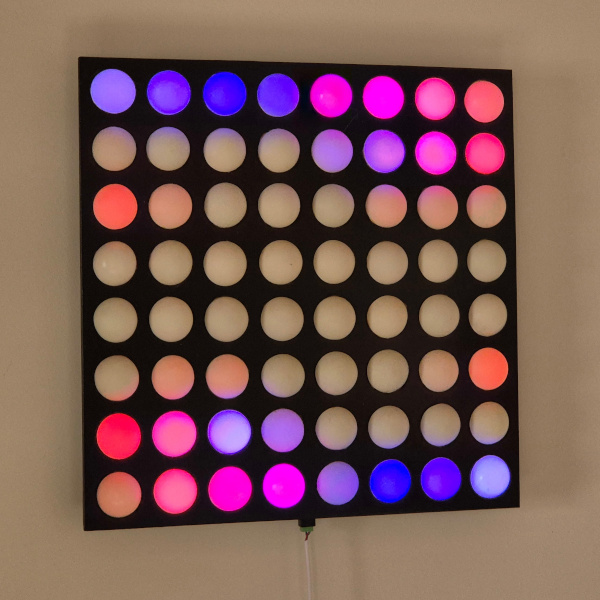
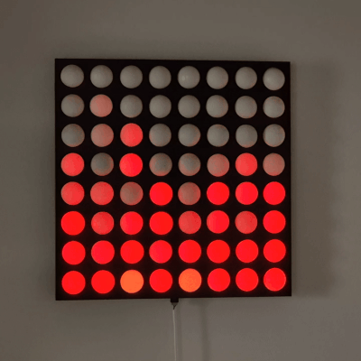
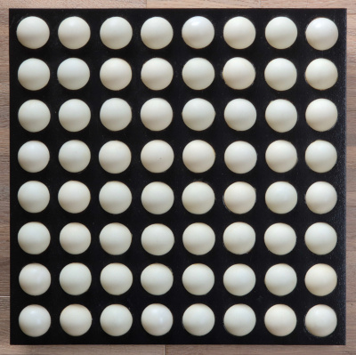
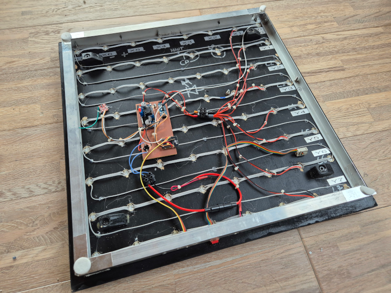
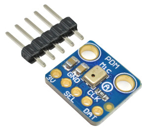

# ESPHome LED Pong

Lire cela en [français](README.fr.md)

## Présentation

The device consists of 64 LEDs organized in 8 lines of 8.

Started over a decade ago and left on standby for many years, this project was initially designed to use an AVR microcontroller and basic red LEDs. However, the advent of chainable WS2812B RGB LEDs significantly simplified the design. I decided to revive the project by switching to WS2812B LEDs, which allow for seamless control of brightness and color. Additionally, adopting an ESP32 as the microcontroller enhanced development thanks to its superior capabilities. On the software front, I relied entirely on ESPHome to streamline the process further and simplify integration.

ESPHome's default effects are pre-configured, but it's very easy to add new ones: below, the `Fire` effect:

An example of an effect that reacts to sounds in the room:

## Features

* Controls a matrix of 64 RGB LEDs
* Sound sensor and capacitive for changing effects
* Use of ESPHome for easy integration with home automation systems

## Fabrication

Equipment list:

* Wooden stand + aluminum frame
* 32 ping pong balls to be gently cut in 2
* 64 WS2812B LEDs
* ESP32 board
* A 5V regulator capable of supplying the current required by the leds
* A micro PDM type MP34DT01
* Capacitive sensor

### LED Matrix

La première led WS2812B est connectée sur le pin GPIO26 de l'ESP32 puis les leds sont chainées (voir photo).

### Power supply

I power the assembly via a 12V mains supply and a jack plug located at the bottom, a fuse is present for safety, and a diode bridge means you don't have to worry about the polarity of the power supply.

The 12V drives a 5V regulator which will be used for the LEDs.

Finally, a 3.3V regulator is used to power the ESP32, you can omit this if you're using a 'Dev Kit' board that already includes appropriate voltage regulation.

### Micro PDM

A MEMS sensor is used to react to sound.

Connect the WS pin to GPIO19 and DATA to GPIO22.

### Capacitive sensor

To build the case, I used aluminum “L” profiles that go all the way around and connected them electrically together, connecting a TTP223 type sensor to them via a wire.

The sensor being very sensitive, it sometimes triggered on its own, so I had to change the capacitor to reduce its sensitivity. Despite this, some false detections can occur, which is why I added a switch (`Touch Pad Disabled`) in ESPHome to disable it completely.

This sensor is connected to GPIO4.

### Software

Once everything's connected, just press: `esphome run ledpong.yaml` and you're ready to go.

## History

### 2025-01-06

* Publication of the project

## Inspiration / Sources

* Initially, this project was inspired by Tetalab's LED Pong Wall, but unfortunately the project link seems to have disappeared.
* This project uses the [Audio Reactive LED Strip library](https://github.com/zhujisheng/audio-reactive-led-strip) to create sound-reactive effects.
* The fire effect comes from [FastLED Fire Effect](https://github.com/esphome/feature-requests/issues/265#issuecomment-1000247345)

## Files

* ledpong.yaml: The ESPHome configuration file
* network.yaml: Your network information
* secrets.yaml: Secret information about your network
